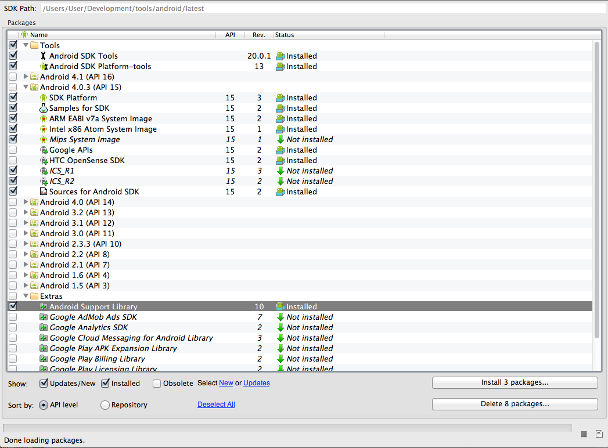

# Overview #

This SDK provides a native slippy map implementation allowing clients to access the Ordnance Survey tileserver for both pro and open tilesets.

The SDK is targeted at API level 10 and above - Gingerbread. For best performance, API level 12 (Honeycomb) and above are recommended since they provide hardware acceleration options.

## Requirements ##

In order to build with the SDK, you will need to have the following available:  

__Android SDK__

Available from <http://developer.android.com/sdk/index.html>. At a minimum, you should have installed:

- Android API level 10 (Gingerbread) package - API level 15 (ICS) or 16 (JellyBean) preferred
- Android support library V4
- SDK tools (traceview, DDMS etc)

__IDE__

Two good options are available

- Eclipse IDE with ADT tools <http://developer.android.com/sdk/installing/installing-adt.html>
- Intellij Community Edition <http://www.jetbrains.com/idea/free_java_ide.html>

__Java__

Recent JDK 6+

__Ant__

Recent ANT installation (1.7+)
 

## Tested Devices ##

- Nexus 7 (JellyBean)
- Samsung S3 (ICS)
- HTC Wildfire (Gingerbread)

## Sample Apps ##

For more information on the apps, see the samples documentation.